# Class Diagram - Proposed Python Design

```mermaid
classDiagram
    class User {
        int id
        string username
        string email
        string role
        bool is_active
        bool force_password_change
    }

    class Employee {
        int id
        int user_id
        int manager_id
        string full_name
        string department
        string designation
        string status
        bool is_active
    }

    class Project {
        int id
        string name
        string status
        string health_status
        string start_date
        string end_date
        int manager_user_id
        int total_story_points
    }

    class Allocation {
        int id
        int employee_id
        int project_id
        int utilization_percent
        string alloc_start
        string alloc_end
    }

    class Timesheet {
        int id
        int employee_id
        string week_start
        int total_hours
        string status
    }

    class TimesheetEntry {
        int id
        int timesheet_id
        int project_id
        int hours
    }

    class Skill {
        int id
        string name
        string category
    }

    class EmployeeSkill {
        int id
        int employee_id
        int skill_id
        string proficiency
    }

    class Milestone {
        int id
        int project_id
        string title
        string due_date
        int story_points
        string status
    }

    class SystemConfig {
        string llm_provider
        string llm_api_key_encrypted
        int scheduler_interval_hours
        int max_weekly_hours
    }

    class EmployeeService {
        update_employee()
        deactivate_employee()
        assign_manager()
        manage_skills()
        list_team()
    }

    class AllocationService {
        create_allocation()
        end_allocation()
        validate_capacity()
        validate_same_team()
    }

    class TimesheetService {
        submit_timesheet()
        get_employee_timesheets()
        validate_entries()
    }

    class ProjectHealthService {
        compute_health()
        build_risk_context()
    }

    class AISkillMatchService {
        match()
    }

    class AIRiskSummaryService {
        summarize()
    }

    class IAIProvider {
        <<interface>>
        rank_candidates()
        summarize_risk()
    }

    class GeminiProvider {
    }

    class GroqProvider {
    }

    class AuthService {
        login()
        change_password()
        reset_password()
    }

    class SchedulerService {
        run_periodic_jobs()
        recompute_utilization()
        recompute_project_health()
    }

    class UserRepository {
        <<interface>>
        add()
        get_by_username()
        save()
    }

    class EmployeeRepository {
        <<interface>>
        add()
        get_by_id()
        save()
    }

    class ProjectRepository {
        <<interface>>
        add()
        get_by_id()
        save()
    }

    class AllocationRepository {
        <<interface>>
        add()
        list_overlaps()
        save()
    }

    class TimesheetRepository {
        <<interface>>
        add()
        get_by_employee_and_week()
    }

    User --> Employee : profile
    User --> Employee : manages_team
    Employee --> EmployeeSkill
    Skill --> EmployeeSkill
    Project --> Milestone
    Employee --> Allocation
    Project --> Allocation
    Employee --> Timesheet
    Timesheet --> TimesheetEntry

    EmployeeService --> EmployeeRepository
    EmployeeService --> UserRepository
    AllocationService --> AllocationRepository
    AllocationService --> EmployeeRepository
    AllocationService --> ProjectRepository
    TimesheetService --> TimesheetRepository
    TimesheetService --> AllocationRepository
    ProjectHealthService --> ProjectRepository
    ProjectHealthService --> TimesheetRepository
    AISkillMatchService ..> IAIProvider
    AIRiskSummaryService ..> IAIProvider
    GeminiProvider ..|> IAIProvider
    GroqProvider ..|> IAIProvider
    AuthService --> UserRepository
    SchedulerService --> ProjectHealthService
    SchedulerService --> AllocationService
```

## Design Principles

- **SRP:** Separate services for auth, allocation, timesheet, health, and AI.
- **OCP:** `IAIProvider` allows new LLM providers without changing use cases.
- **DIP:** Services depend on repository and provider interfaces.
- **SoC:** Console, API, domain, and infrastructure are separated.

