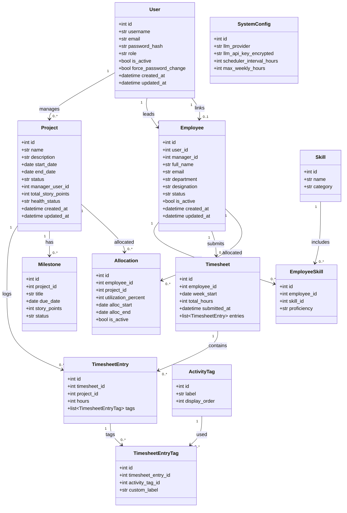
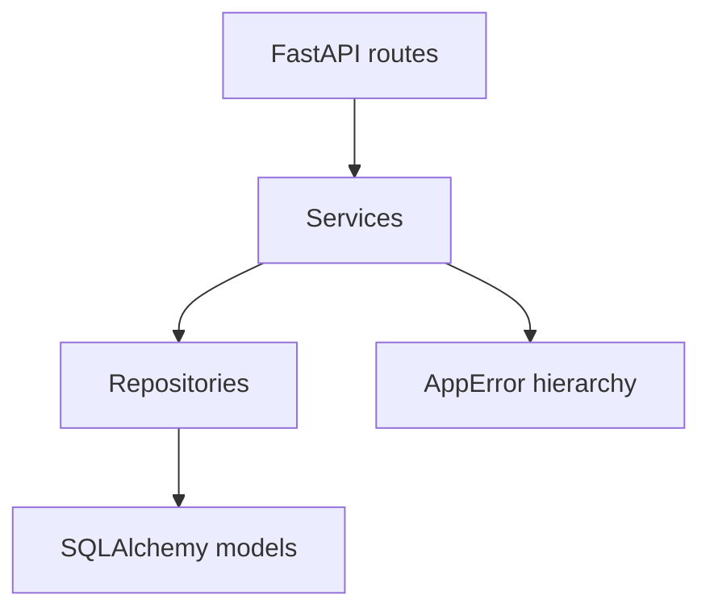

# Class Diagram — PRM Tool

UML class diagram: **each class is one box** with **attributes (variables) on top** and **methods below**, separated by a line. Relationships show how layers connect.

## Visibility symbols (`+`, `-`, `#`)

| Symbol | Name | Meaning | Used in this project |
|---|---|---|---|
| **`+`** | **public** | Any class / caller can access | API-facing service methods (`login`, `create_project`), model fields, repository CRUD |
| **`-`** | **private** | Internal only; not part of the public API | Python helpers prefixed with `_` (`_get_or_404`, `_validate_manager`) |
| **`#`** | **protected** | Visible to the class and its **subclasses** only | `BaseRepository` CRUD methods inherited by `EmployeeRepository`, `AllocationRepository`, etc. |

> **Python note:** Python has no strict `private` / `protected` keywords. A leading `_` is a **convention** for internal use. In this diagram, `_methods` are marked `-`, and inherited repository methods used by subclasses are marked `#`.

### Preview

- **Cursor:** open this file → **Ctrl + Shift + V** (Markdown preview)
- **Online:** paste a ` ```mermaid ` block into [mermaid.live](https://mermaid.live) → export PNG / SVG / PDF

---

## 1. Domain models (SQLAlchemy entities)



---

## 2. Repository layer

```mermaid
classDiagram
    direction TB

    class BaseRepository~T~ {
        #type model
        #Session db
        +__init__(model, db)
        #get(entity_id) T
        #list() list~T~
        #add(entity) T
        #update(entity) T
        #delete(entity) void
    }

    class UserRepository {
        +get_by_username(username) User
        +get_by_email(email) User
    }

    class EmployeeRepository {
        +get_by_user_id(user_id) Employee
        +list_by_manager(manager_user_id) list~Employee~
    }

    class ProjectRepository {
        +get_by_name(name) Project
        +list_by_manager(manager_user_id) list~Project~
    }

    class AllocationRepository {
        +list_active(employee_id, project_id) list~Allocation~
        +list_active_for_employee(employee_id) list~Allocation~
        +list_for_employee_in_period(employee_id, start, end) list~Allocation~
    }

    class MilestoneRepository {
        +list_for_project(project_id) list~Milestone~
        +get_for_project(project_id, milestone_id) Milestone
        +sum_done_points(project_id) int
    }

    class TimesheetRepository {
        +get_for_employee_week(employee_id, week_start) Timesheet
        +list_for_employee(employee_id) list~Timesheet~
    }

    class SkillRepository {
        +get_by_name(name) Skill
    }

    class EmployeeSkillRepository {
        +list_for_employee(employee_id) list~EmployeeSkill~
        +get_by_employee_and_skill(employee_id, skill_id) EmployeeSkill
        +get_for_employee(employee_id, row_id) EmployeeSkill
    }

    class ActivityTagRepository {
        +list_ordered() list~ActivityTag~
    }

    BaseRepository~T~ <|-- UserRepository
    BaseRepository~T~ <|-- EmployeeRepository
    BaseRepository~T~ <|-- ProjectRepository
    BaseRepository~T~ <|-- AllocationRepository
    BaseRepository~T~ <|-- MilestoneRepository
    BaseRepository~T~ <|-- TimesheetRepository
    BaseRepository~T~ <|-- SkillRepository
    BaseRepository~T~ <|-- EmployeeSkillRepository
    BaseRepository~T~ <|-- ActivityTagRepository

    UserRepository ..> User : persists
    EmployeeRepository ..> Employee : persists
    ProjectRepository ..> Project : persists
    AllocationRepository ..> Allocation : persists
```



---

## 3. Service layer (business logic)

```mermaid
classDiagram
    direction TB

    class AuthService {
        -UserRepository users
        +login(username, password) tuple
        +change_password(user, current, new) User
    }

    class UserService {
        -Session db
        -UserRepository users
        -EmployeeRepository employees
        +create_user(full_name, email, username, password, role) User
        +list_users() list~User~
        +reset_password(identifier, new_password) User
        +set_active(identifier, is_active) User
        -_find_user(identifier) User
    }

    class EmployeeService {
        -Session db
        -EmployeeRepository employees
        -UserRepository users
        +list_employees() list~Employee~
        +update_employee(employee_id, ...) Employee
        +assign_manager(employee_user_id, manager_user_id) Employee
        +deactivate_employee(employee_id) Employee
        -_get_or_404(employee_id) Employee
    }

    class ProjectService {
        -Session db
        -ProjectRepository projects
        -UserRepository users
        -EmployeeRepository employees
        -MilestoneRepository milestones
        +create_project(...) dict
        +list_projects() list~dict~
        +update_project(project_id, ...) dict
        -_manager_name(manager_user_id) str
        -_validate_manager(manager_user_id) void
        -_validate_dates(start, end) void
        -_to_response(project) dict
    }

    class AllocationService {
        -Session db
        -AllocationRepository allocations
        -EmployeeRepository employees
        -ProjectRepository projects
        +list_allocations(employee_id, project_id) list~dict~
        +list_team_employees(manager_user_id) list~dict~
        +list_manager_projects(manager_user_id) list~dict~
        +create_allocation(manager_user_id, ...) dict
        +end_allocation(manager_user_id, allocation_id) dict
        -_allocation_row(row) dict
        -_utilization_in_period(employee_id, start, end) int
        -_refresh_employee_status(employee_id) void
        -_get_manager_project(manager_user_id, project_id) Project
        -_get_team_employee(manager_user_id, employee_id) Employee
    }

    class MilestoneService {
        -Session db
        -ProjectRepository projects
        -MilestoneRepository milestones
        +list_milestones(project_id) dict
        +add_milestone(project_id, title, due_date, story_points) dict
        +update_status(project_id, milestone_id, status) dict
        -_get_project_or_404(project_id) Project
        -_milestone_row(milestone) dict
    }

    class SkillService {
        -Session db
        -EmployeeRepository employees
        -SkillRepository skills
        -EmployeeSkillRepository employee_skills
        +list_employee_skills(employee_id) list~dict~
        +add_skill(employee_id, name, category, proficiency) dict
        +update_proficiency(employee_id, row_id, proficiency) dict
        +remove_skill(employee_id, row_id) void
        -_get_employee_or_404(employee_id) Employee
        -_get_or_create_skill(name, category) Skill
    }

    class TimesheetService {
        -Session db
        -TimesheetRepository timesheets
        -AllocationRepository allocations
        -EmployeeRepository employees
        -ProjectRepository projects
        -ActivityTagRepository activity_tags
        +list_activity_tags() list~dict~
        +get_reminder(user_id) dict
        +preview_week(user_id, week_start) dict
        +submit_timesheet(user_id, week_start, entries) dict
        +list_timesheets(user_id) list~dict~
        +get_timesheet_detail(user_id, week_start) dict
        +list_my_allocations(user_id) dict
        +list_team_timesheets(manager_user_id, week_start) dict
        +get_team_employee_timesheet(manager_user_id, employee_id, week_start) dict
        -_get_employee_for_user(user_id) Employee
        -_max_weekly_hours() int
        -_validate_week_start(week_start) date
        -_allocations_for_week(employee_id, week_start) list
    }

    class AppError {
        +int status_code
        +str message
    }

    class AuthenticationError
    class PermissionDeniedError
    class NotFoundError
    class ValidationError

    AuthService --> UserRepository
    UserService --> UserRepository
    UserService --> EmployeeRepository
    EmployeeService --> EmployeeRepository
    EmployeeService --> UserRepository
    ProjectService --> ProjectRepository
    ProjectService --> UserRepository
    ProjectService --> EmployeeRepository
    ProjectService --> MilestoneRepository
    AllocationService --> AllocationRepository
    AllocationService --> EmployeeRepository
    AllocationService --> ProjectRepository
    MilestoneService --> ProjectRepository
    MilestoneService --> MilestoneRepository
    SkillService --> EmployeeRepository
    SkillService --> SkillRepository
    SkillService --> EmployeeSkillRepository
    TimesheetService --> TimesheetRepository
    TimesheetService --> AllocationRepository
    TimesheetService --> EmployeeRepository
    TimesheetService --> ProjectRepository
    TimesheetService --> ActivityTagRepository

    AppError <|-- AuthenticationError
    AppError <|-- PermissionDeniedError
    AppError <|-- NotFoundError
    AppError <|-- ValidationError
```



---

## Layer summary



| Layer | Responsibility |
|---|---|
| **Models** | Database tables as Python classes (`+` attributes = columns) |
| **Repositories** | Data access; `#` methods inherited from `BaseRepository` |
| **Services** | Business rules; `+` = public API, `-` = internal helpers |
| **Exceptions** | Typed errors returned to the API layer |
