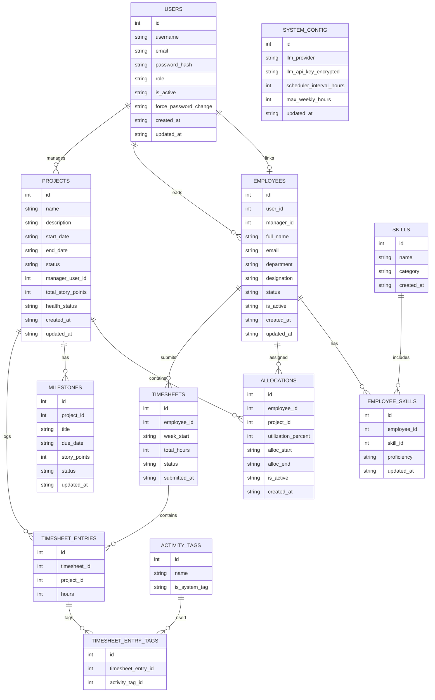

# ER Diagram - PRM Tool

## Keys and Constraints
| Rule | Detail |
|---|---|
| USERS | `username`, `email` unique |
| EMPLOYEES | `user_id` unique FK to USERS; `manager_id` FK to USERS (manager) |
| PROJECTS | `name` unique; `manager_user_id` FK to USERS; `total_story_points` >= 0 |
| MILESTONES | `story_points` >= 0; project SP = sum of milestone SP |
| TIMESHEETS | unique per `employee_id` + `week_start` |
| ALLOCATIONS | overlapping totals must not exceed 100% |

## Enum Reference
| Table | Column | Values |
|---|---|---|
| USERS | role | ADMIN, MANAGER, EMPLOYEE |
| EMPLOYEES | status | BENCH, ALLOCATED |
| SKILLS | category | BACKEND, FRONTEND, DEVOPS, QA, OTHER |
| EMPLOYEE_SKILLS | proficiency | BEGINNER, INTERMEDIATE, ADVANCED |
| PROJECTS | status | PLANNED, ACTIVE, ON_HOLD, COMPLETED |
| PROJECTS | health_status | ON_TRACK, ATTENTION, AT_RISK |
| MILESTONES | status | NOT_STARTED, IN_PROGRESS, DONE |
| TIMESHEETS | status | SUBMITTED, MISSED |
| SYSTEM_CONFIG | llm_provider | GEMINI, GROQ |
