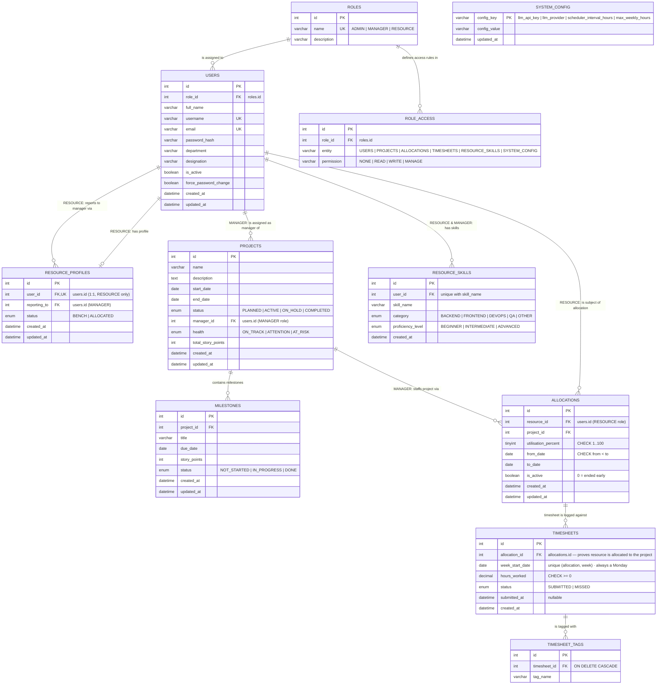

# PRM Tool — ER Diagram (V2 · Role-Based)

## Design Philosophy

Everyone in the system is a **resource** — admin, manager, and normal employees alike.
There is a single **USERS** table that holds all people. Their capabilities and permissions
are determined entirely by the role assigned to them via the **ROLES** table.

Role-specific fields are kept out of USERS and stored in dedicated mapping/profile tables:

| Mapping Table | Who has a row | What it stores |
|---|---|---|
| `ROLE_ACCESS` | Every role | Permission level per entity |
| `RESOURCE_PROFILES` | RESOURCE role only | `status` (BENCH/ALLOCATED) and `reporting_to` |

This eliminates nulls:
- `status` only exists for RESOURCEs → lives in `RESOURCE_PROFILES`, never null
- `reporting_to` only exists for RESOURCEs → lives in `RESOURCE_PROFILES`, never null
- MANAGERs report to no one — they simply have no entry in any reporting table

| Role | Interacts with |
|---|---|
| `ADMIN` | USERS (full CRUD), PROJECTS (full CRUD), SYSTEM_CONFIG (read/write) |
| `MANAGER` | PROJECTS (own — read/update), ALLOCATIONS (create/end for own team), RESOURCE_SKILLS (read), TIMESHEETS (read team's) |
| `RESOURCE` | RESOURCE_PROFILES (own), RESOURCE_SKILLS (own — CRUD), ALLOCATIONS (own — read only), TIMESHEETS (own — submit/view) |

**Many-to-many relationships** resolved through junction tables:
- `USERS` ↔ `PROJECTS` → via `ALLOCATIONS` (a resource can be on many projects; a project has many resources)
- `TIMESHEETS` are accessed through `ALLOCATIONS` — there are no direct FK links from TIMESHEETS to USERS or PROJECTS

The manager-resource relationship is captured directly via `RESOURCE_PROFILES.reporting_to → users.id`.


    }

    SYSTEM_CONFIG {
        varchar config_key PK "llm_api_key | llm_provider | scheduler_interval_hours | max_weekly_hours"
        varchar config_value
        datetime updated_at
    }
```

        varchar tag_name
    }

    SYSTEM_CONFIG {
        varchar config_key PK "llm_api_key | llm_provider | scheduler_interval_hours | max_weekly_hours"
        varchar config_value
        datetime updated_at
    }
```
