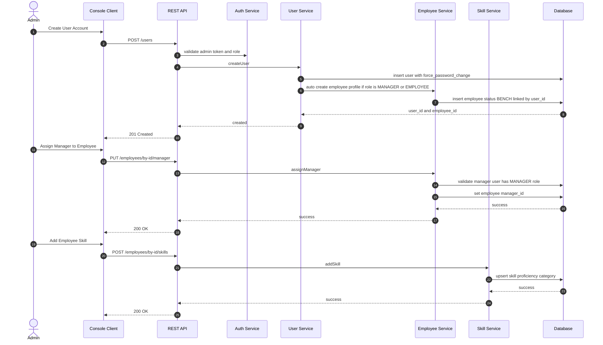
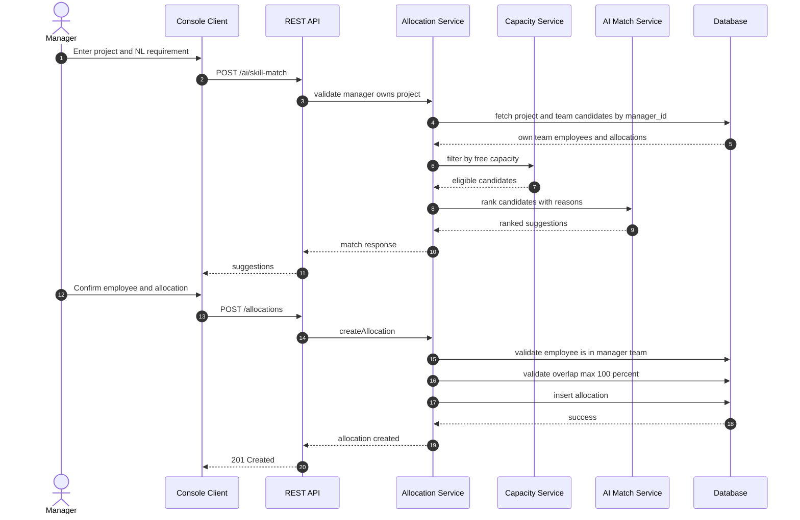
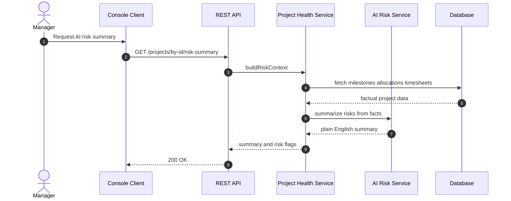
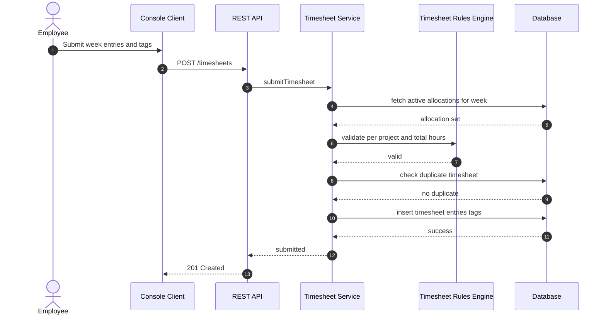
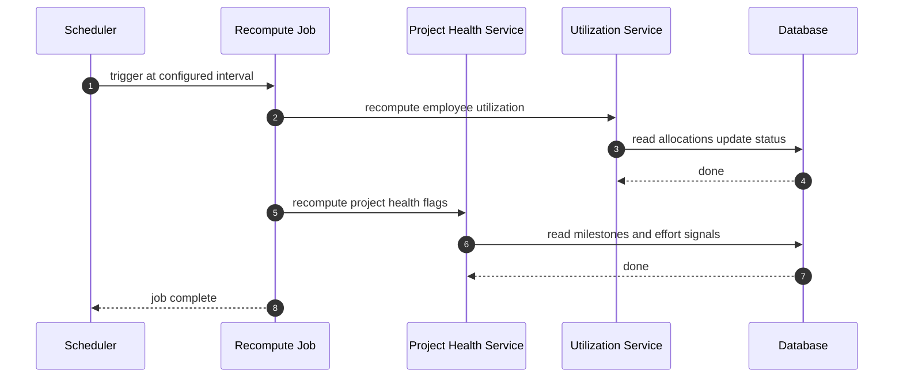

# Sequence Diagrams - All Roles

## 1) Admin - Create User, Assign Manager, and Skills

> Note: V4 removed the separate "Add Employee" screen. The employee profile is created automatically when an Admin creates a MANAGER or EMPLOYEE user account, then enriched via Update Employee, Assign Manager, and Manage Skills.

## 2) Manager - AI Assisted Allocation

## 3) Manager - Project Risk Summary

## 4) Employee - Weekly Timesheet Submission

## 5) Scheduler - Health and Utilization Recompute

