# Use Case Diagram - PRM Tool

```mermaid
%%{init: {"theme":"base","themeVariables":{"fontSize":"16px","lineColor":"#334155"}}}%%
flowchart TB
    Admin(["Admin"])
    Manager(["Manager"])
    Employee(["Employee"])

    subgraph PRM["PRM System Boundary"]
        UC_Login(["Login"])
        UC_ChangePwd(["Force Password Change on First Login"])
        UC_Logout(["Logout"])
        UC_CreateUser(["Manage Users"])
        UC_ResetPwd(["Reset User Password"])
        UC_AddEmployee(["Manage Employees"])
        UC_DeactivateEmployee(["Deactivate Employee"])
        UC_ManageSkills(["Manage Employee Skills"])
        UC_AssignManager(["Assign Manager to Employee"])
        UC_ProjectMgmt(["Manage Projects and Story Points"])
        UC_Milestones(["Manage Milestones and Story Points"])
        UC_AllAllocations(["View All Allocations"])
        UC_SystemConfig(["System Configuration"])
        UC_Dashboard(["Resource Dashboard"])
        UC_Allocate(["Allocate Resource"])
        UC_DirectAllocate(["Direct Allocation"])
        UC_EndAllocation(["End Allocation"])
        UC_MyProjects(["My Projects and Health"])
        UC_ViewTeamTS(["View Team Timesheets"])
        UC_AISkill(["AI Skill Match"])
        UC_AIRisk(["AI Risk Summary"])
        UC_SubmitTS(["Submit Timesheet"])
        UC_ViewMyTS(["View My Timesheets"])
        UC_ViewMyAlloc(["View My Allocations"])
    end

    Admin --> UC_Login
    Admin --> UC_ChangePwd
    Admin --> UC_Logout
    Admin --> UC_CreateUser
    Admin --> UC_ResetPwd
    Admin --> UC_AddEmployee
    Admin --> UC_DeactivateEmployee
    Admin --> UC_ManageSkills
    Admin --> UC_AssignManager
    Admin --> UC_ProjectMgmt
    Admin --> UC_Milestones
    Admin --> UC_AllAllocations
    Admin --> UC_SystemConfig

    Manager --> UC_Login
    Manager --> UC_ChangePwd
    Manager --> UC_Logout
    Manager --> UC_Dashboard
    Manager --> UC_Allocate
    Manager --> UC_DirectAllocate
    Manager --> UC_EndAllocation
    Manager --> UC_MyProjects
    Manager --> UC_ViewTeamTS
    Manager --> UC_AISkill
    Manager --> UC_AIRisk

    Employee --> UC_Login
    Employee --> UC_ChangePwd
    Employee --> UC_Logout
    Employee --> UC_SubmitTS
    Employee --> UC_ViewMyTS
    Employee --> UC_ViewMyAlloc

    UC_Allocate -.->|include| UC_AISkill
    UC_DirectAllocate -.->|alternative| UC_Allocate
    UC_MyProjects -.->|include| UC_AIRisk
    UC_DeactivateEmployee -.->|triggers| UC_EndAllocation
    UC_AssignManager -.->|scopes| UC_Dashboard

    classDef actorStyle fill:#F3F4F6,stroke:#374151,color:#111827,stroke-width:2px
    classDef commonStyle fill:#FFF7E6,stroke:#D97706,color:#7C2D12,stroke-width:1.5px
    classDef adminStyle fill:#E0F2FE,stroke:#0369A1,color:#0C4A6E,stroke-width:1.5px
    classDef mgrStyle fill:#ECFDF5,stroke:#15803D,color:#14532D,stroke-width:1.5px
    classDef empStyle fill:#F5F3FF,stroke:#6D28D9,color:#4C1D95,stroke-width:1.5px

    class Admin,Manager,Employee actorStyle
    class UC_Login,UC_ChangePwd,UC_Logout commonStyle
    class UC_CreateUser,UC_ResetPwd,UC_AddEmployee,UC_DeactivateEmployee,UC_ManageSkills,UC_AssignManager,UC_ProjectMgmt,UC_Milestones,UC_AllAllocations,UC_SystemConfig adminStyle
    class UC_Dashboard,UC_Allocate,UC_DirectAllocate,UC_EndAllocation,UC_MyProjects,UC_ViewTeamTS,UC_AISkill,UC_AIRisk mgrStyle
    class UC_SubmitTS,UC_ViewMyTS,UC_ViewMyAlloc empStyle
```

## Legend
| Color | Role area |
|---|---|
| Gray | Actors |
| Amber | Common authentication |
| Blue | Admin |
| Green | Manager |
| Purple | Employee |

## Notes
- Force password change is required on first login for admin-created accounts.
- Allocate Resource supports AI-assisted and direct allocation.
- End Allocation is limited to the manager who owns the project.
- Admin assigns each employee to a manager (`manager_id`); managers only see and allocate their own team.
- Projects and milestones now carry story points for progress tracking.
