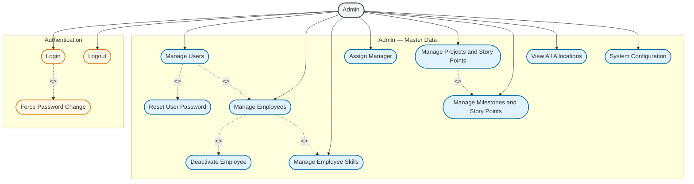

# Admin Actor — Use Case Diagram

The **Admin** is the system operator (HR/ops). In PRM this is the role that manages **user accounts** and **master data**. Admin does not allocate resources or submit timesheets.

Shared authentication (Login, Logout, Change Password) is shown here because Admin must authenticate like any other role.

---

## Use Case Diagram

---

## Use case summary

| Use case | What Admin does |
|----------|-----------------|
| Login / Logout | Authenticate into Admin menu |
| Force Password Change | Required on first login for Admin-created accounts |
| Manage Users | Create, view, deactivate/reactivate accounts (Admin, Manager, Employee roles) |
| Reset User Password | Set temporary password; user must change on next login |
| Manage Employees | View all, update profile fields |
| Deactivate Employee | Soft-deactivate profile; active allocations ended |
| Manage Employee Skills | Add/update/remove skills and proficiency |
| Assign Manager | Set `manager_id` so Manager sees only their team |
| Manage Projects | Create, view, update projects and total story points |
| Manage Milestones | Add/update milestones and story points per project |
| View All Allocations | Company-wide allocation matrix (read-only) |
| System Configuration | LLM provider/key, scheduler interval, max weekly hours |

---

## Relationships in this diagram

| Link | Type | Meaning |
|------|------|---------|
| Login → Change Password | `<<extend>>` | Password change runs **only when** first-login flag is set |
| Manage Users → Manage Employees | `<<include>>` | Creating Manager/Employee role **always** creates an employee profile |
| Manage Users → Reset Password | `<<include>>` | User management flow **includes** password reset as a sub-action |
| Manage Employees → Deactivate / Skills | `<<include>>` | Employee management **includes** these sub-features |
| Manage Projects → Manage Milestones | `<<include>>` | Project management **includes** milestone management |

---

## Admin cannot do

- Create allocations (Manager only)
- Submit or edit timesheets
- Use Manager AI dashboard for day-to-day allocation
