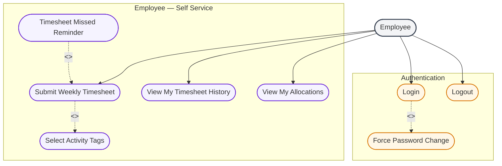

# Employee Actor — Use Case Diagram

The **Employee** is the individual contributor: submits weekly timesheets with hours and activity tags, and views own allocations. No access to other employees, projects, or allocation management.

---

## Use Case Diagram

---

## Use case summary

| Use case | What Employee does |
|----------|-------------------|
| Submit Weekly Timesheet | Log hours per allocated project for a week |
| Select Activity Tags | Tag work type (e.g. API Development, Bug Fixing) |
| View My Timesheet History | Past weeks with SUBMITTED / MISSED status |
| View My Allocations | Own project assignments, %, dates, ACTIVE flag |
| Timesheet Missed Reminder | Menu warning if previous week was not submitted |

---

## Relationships in this diagram

| Link | Type | Meaning |
|------|------|---------|
| Login → Change Password | `<<extend>>` | Only on first login |
| Submit → Select Activity Tags | `<<include>>` | Every submission **must** attach activity tags to entries |
| Missed Reminder → Submit | `<<extend>>` | Reminder **optionally** prompts employee to submit when a week was missed |

---

## Validation rules

| Rule | Detail |
|------|--------|
| Projects | Only projects the employee was allocated to that week |
| Hours per project | ≤ allocation % × max weekly hours |
| Total hours | ≤ max weekly hours (default 40 from system config) |
| Duplicate | One timesheet per employee per week |
| Future weeks | Cannot submit for a week that has not started |

---

## Employee cannot do

- View other employees' data
- Create or edit allocations
- Manage projects or system settings
