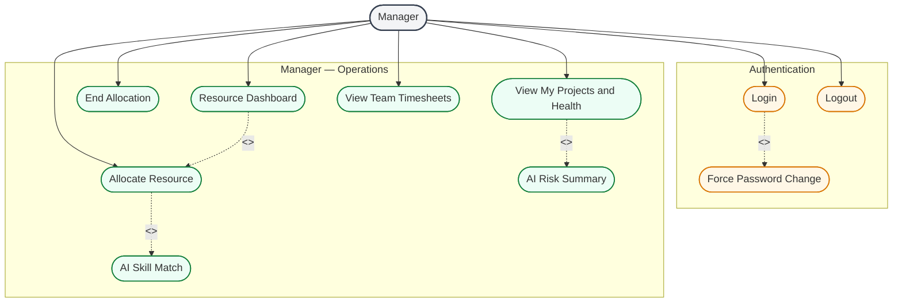

# Manager Actor — Use Case Diagram

The **Manager** is the delivery manager: searches for team resources, allocates people to **own projects**, monitors health, and views team timesheets (read-only). Scope is limited to **own team** (`manager_id`) and **own projects** (`manager_user_id`).

---

## Use Case Diagram

---

## Use case summary

| Use case | What Manager does |
|----------|-------------------|
| Resource Dashboard | Bench + allocated counts for **own team only** |
| Allocate Resource | Assign team member to own project with % and dates |
| End Allocation | End allocation on own project (set end date to today) |
| View My Projects and Health | Projects where `manager_user_id` = this manager; health flags |
| View Team Timesheets | Read-only SUBMITTED / MISSED status for team |
| AI Skill Match | Optional natural-language search for best team candidates |
| AI Risk Summary | Optional plain-English risk paragraph for a project |

---

## Relationships in this diagram

| Link | Type | Meaning |
|------|------|---------|
| Login → Change Password | `<<extend>>` | Only on first login |
| Allocate → AI Skill Match | `<<extend>>` | Manager **may** use AI; direct allocation without AI is also valid |
| My Projects → AI Risk Summary | `<<extend>>` | Manager **may** request AI summary; health flags show without AI |
| Dashboard → Allocate | `<<include>>` | Dashboard is the entry point that leads into allocation workflow |

---

## Business rules (viva)

| Rule | Detail |
|------|--------|
| Team scope | Only employees where `employee.manager_id` = manager's user id |
| Project scope | Only projects where `project.manager_user_id` = manager's user id |
| Utilization | Overlapping allocations for same employee must not exceed **100%** |
| Timesheets | **Read-only** — Manager cannot edit employee submissions |

---

## Manager cannot do

- Edit employee profiles or system config
- Create user accounts
- View company-wide allocations (Admin only)
