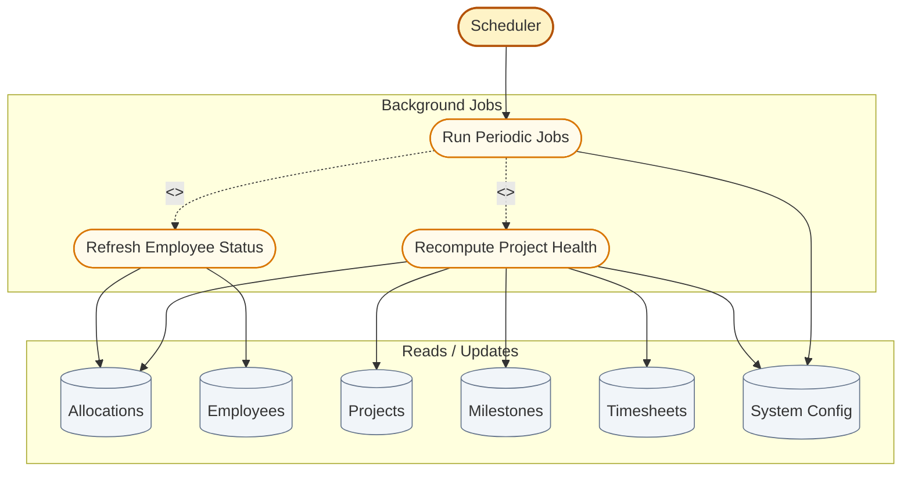

# Scheduler Actor — Use Case Diagram

The **Scheduler** is a **non-human system actor**. It runs inside the FastAPI server (APScheduler) on a fixed interval from `SYSTEM_CONFIG.scheduler_interval_hours`. No console login — it triggers automatically at startup and on each interval.

---

## Use Case Diagram

---

## Use case summary

| Use case | What happens |
|----------|--------------|
| Run Periodic Jobs | Main job fired by APScheduler every N hours (+ once at API startup) |
| Refresh Employee Status | Set each active employee to **BENCH** or **ALLOCATED** based on active allocations |
| Recompute Project Health | Set `health_status` to ON_TRACK, ATTENTION, or AT_RISK using milestones + logged hours |

---

## Relationships in this diagram

| Link | Type | Meaning |
|------|------|---------|
| Run Periodic Jobs → Refresh Employee Status | `<<include>>` | Every scheduler run **always** updates bench/allocated flags |
| Run Periodic Jobs → Recompute Project Health | `<<include>>` | Every scheduler run **always** recalculates project health |

---

## Health logic (summary)

| Status | Typical triggers |
|--------|------------------|
| **AT_RISK** | Milestone overdue ≥ 5 days, OR ≥ 2 overdue milestones, OR logged hours &lt; 25% of expected |
| **ATTENTION** | Milestone overdue ≥ 1 day, OR logged hours &lt; 50% of expected |
| **ON_TRACK** | None of the above |

Expected hours = `max_weekly_hours × allocation.utilization_percent / 100`.

---

## Who configures the Scheduler?

| Actor | Action |
|-------|--------|
| **Admin** | Sets `scheduler_interval_hours` in System Configuration |
| **Scheduler** | Reads config and runs jobs — no user interaction |

---

## Scheduler vs human actors

| | Human (Admin/Manager/Employee) | Scheduler |
|--|-------------------------------|-----------|
| Triggers | User selects menu option | Timer / API startup |
| Interface | Console client | Server background thread |
| Purpose | Business operations | Keep derived data fresh |
